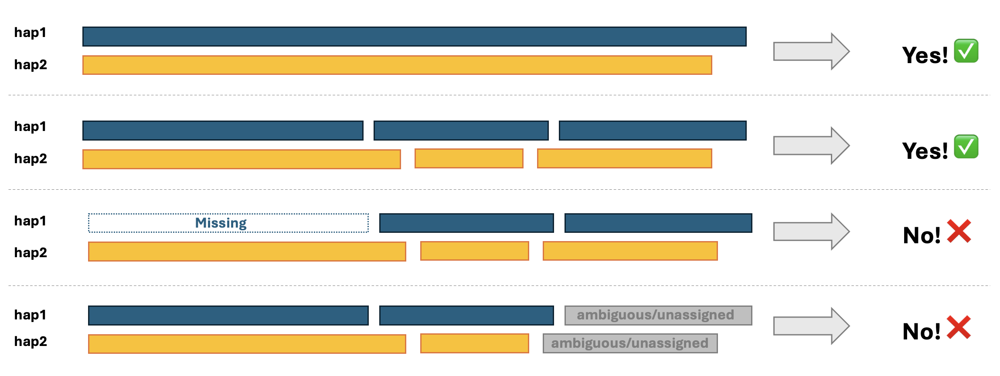

# POOCH

Parent-of-Origin Classification of Haplotypes.

POOCH is a Snakemake-based pipeline for assigning chromosome labels and determining the parent of origin (maternal or paternal) of near-complete genome assemblies.

```bash
 / \__          ┌─────────────────────────────────────┐
(    @\___      │               POOCH                 │
 /         O    │ Parent Of Origin Classification     │
/   (_____/     │          Of Haplotypes              │
/_____/   U     └─────────────────────────────────────┘

```

The input contigs do not need to be telomere-to-telomere assemblies and may consist of multiple scaffolds, but they must be correctly assigned to their respective haplotypes.


## Installation

```bash
# clone this git repository
git clone https://github.com/marbl/Pooch.git
cd Pooch/

# make new environment usimg yml file
mamba create -n pooch -f Pooch_environment.yml  -vvv --channel-priority flexible

# activate env
mamba activate pooch

# move working directory to pofo_tools within Pooch
cd pofo_tools/ 

# install python package
pip install .
```

## Prediction

### What It Does

- Aligns ONT or HiFi reads to a personalized diploid genome
- Calls methylation from primary alignments
- Lifts methylation calls back to CHM13 reference coordinates
- Builds chain-based chromosome assignments
- Predicts parent-of-origin labels per chromosome

### Pipeline at a Glance

```bash
job                                   count
----------------------------------  -------
all                                       1
step00_methylation_tag_check              1
step01_generate_personalized_genome       1 # skip if diploid assembly is provided
step02_align                              1 # skip if BAM is provided
step03_make_chain                         1 # skip if chain files are provided
step04_call_methylation                   1 # skip if methylation BED files are provided
step05_liftover_hap1                      1
step05_liftover_hap2                      1
step06_chromAssign                        1
step07_check_XX_XY                        1
step08_parent_of_origin_prediction       23
step09_cleaning_output                    1
total                                    33
```

The most time-consuming step is `step02_align`, and its runtime depends on the sequencing coverage of the ONT or HiFi data. The most memory-intensive step is `step03_make_chain`.

## Input Modes

Choose exactly one genome mode:

1. Personalized genome mode: `--personalized_genome` plus haplotype names provided with `--hap1_name` and `--hap2_name`. For example, if your assembly have contigs as belowe: 
	```bash
	contig1_haplotype1
	contig2_haplotype1
	...
	contig100_haplotype2
	contig101_haplotype2
	```
	
	hap1_name should be `haplotype1` and hap2_name should be `haplotype2`.

2. Split FASTA mode: `--hap1_fa` and `--hap2_fa`

At least one data input is required:

1. `--fastq` (alignment + downstream steps)
2. `--bam` (skip alignment)
3. `--metbed` (skip alignment and methylation calling)

## Quick Start

### 1) Personalized genome (diploid) + FASTQ

```bash
./pooch-prediction \
	--reference ref.fa \ # reference that pre-trained model used
	--personalized_genome personalized.fa \
	--hap1_name haplotype1 \ # haplotype 1 name that could grep from the `personalized.fa`
	--hap2_name haplotype2 \ # haplotype 1 name that could grep from the `personalized.fa`
	--fastq reads_1.fastq.gz,reads_2.fastq.gz \
	--platform ONT # ONT or HiFi
```

### 2) Split haplotype FASTA files + BAM

```bash
./pooch-prediction \
	--reference ref.fa \
	--hap1_fa sample.hap1.fa \
	--hap2_fa sample.hap2.fa \
	--bam sample.pri.bam \ # BAM aligned on the personalized genome with methylation tags and filter only primary alignments
```

### 2) Split haplotype FASTA files + BAM

```bash
./pooch-prediction \
	-m1r sample.hap1.liftover_to_ref.bed \
	-m2r sample.hap1.liftover_to_ref.bed
```

### 3) Dry run before execution

```bash
./pooch-prediction \
	--reference ref.fa \
	--personalized_genome personalized.fa \
	--hap1_name haplotype1 \
	--hap2_name haplotype2 \
	--fastq reads.fastq.gz \
	--platform ONT 
	--dry-run
```

### 4) Mark outputs as up to date

```bash
./pooch-prediction \
	--reference ref.fa \
	--personalized_genome personalized.fa \
	--hap1_name haplotype1 \
	--hap2_name haplotype2 \
	--fastq reads.fastq.gz \
	--platform ONT \
	--touch
```

### Primary Outputs

The workflow targets:

- `OUTDIR/chain/SAMPLE.chromAssign.all.txt`
- `OUTDIR/prediction/SAMPLE.predict.out`

Example rows from `SAMPLE.predict.out`:

| Sample | LeftOpHapLabel | RightOpHapLabel | LeftHapPredictedOrigin | RightHapPredictedOrigin | PredictProb_Maternal-Paternal | PredictProb_Paternal-Maternal | PredictionCorrect | Chrom |
| --- | --- | --- | --- | --- | ---: | ---: | --- | --- |
| GM03417_ONT_Winnowmap2 | Hap1 | Hap2 | Paternal | Maternal | 0.00103682 | 0.998963 | Unknown | chr1 |
| GM03417_ONT_Winnowmap2 | Hap1 | Hap2 | Maternal | Paternal | 0.999887 | 0.000113318 | Unknown | chr2 |
| GM03417_ONT_Winnowmap2 | Hap1 | Hap2 | Maternal | Paternal | 0.658104 | 0.341896 | Unknown | chr3 |
| GM03417_ONT_Winnowmap2 | Hap1 | Hap2 | Paternal | Maternal | 0.00135033 | 0.99865 | Unknown | chr4 |

The probability columns are calculated for the maternal-paternal comparison, where `LeftOpHapLabel` represents the left side of the comparison and `RightOpHapLabel` represents the right side. The `PredictProb_Maternal-Paternal` column gives the probability that `LeftOpHapLabel` is maternal and `RightOpHapLabel` is paternal, while `PredictProb_Paternal-Maternal` gives the probability that `LeftOpHapLabel` is paternal and `RightOpHapLabel` is maternal. For example, for chromosome 1, Hap1 is predicted to be paternal and Hap2 is predicted to be maternal.

Example rows from `SAMPLE.chromAssign.all.txt`:

| Chrom | Contig | Strand | AlignBlock |
| --- | --- | --- | ---: |
| chr1 | haplotype1-0000015 | + | 79653 |
| chr1 | haplotype1-0000022 | + | 729435 |
| chr1 | haplotype1-0000031 | + | 228362455 |
| chr1 | haplotype2-0000078 | + | 107998824 |
| chr1 | haplotype2-0000079 | + | 122440753 |

Three contigs from haplotype 1 and two contigs from haplotype 2 are assigned to chromosome 1. Haplotype 1 is predicted to be paternal, and haplotype 2 is predicted to be maternal. Therefore, the first three contigs correspond to the paternal copy of chromosome 1, and the last two contigs correspond to the maternal copy of chromosome 1.

## Training Workflow

Use `pooch-training` to train chromosome-specific parent-of-origin classifiers from a cohort of samples with known maternal and paternal haplotype labels. The training workflow builds methylation matrices, filters CpGs by missingness, creates differential methylation datasets, fits chromosome-specific elastic-net logistic regression models, and writes a summary of selected CpGs and cross-validation performance.

## Pipeline at a glance 
```bash
job                         count
------------------------  -------
step01_Make_Pooch_Inputs       22
step02_Train_Model             22
step03_cleaning_output          1
all                             1
total                          46
```

Required inputs are an FOFN and a sex map:

- `--fofn`: tab-delimited file listing training methylation BED files for both haplotypes, using absolute paths. The BED files should use the same reference genome coordinates to ensure that the differential methylation profiles are coordinate-matched.

```bash
sample1    Paternal    /directory/to/methylation/file/sample1.paternal.liftover_to_ref.bed
sample1    Maternal    /directory/to/methylation/file/sample1.maternal.liftover_to_ref.bed
...
sample10   Paternal    /directory/to/methylation/file/sample10.paternal.liftover_to_ref.bed
sample10   Maternal    /directory/to/methylation/file/sample10.maternal.liftover_to_ref.bed
```

- `--sex_map`: tab-delimited sample sex map used to handle sex-chromosome training. Sex values should be `Male` or `Female`.
```bash
sample1    Male
...
sample10   Female
```

Basic training command:

```bash
./pooch-training \
	--fofn input.fofn \
	--sex_map sex.txt
```

Train only selected chromosomes:

```bash
./pooch-training \
	--fofn input.fofn \
	--sex_map sex.txt \
	--chroms chr1,chr2,chr3
```

### Main outputs

The main training outputs are written to `OUTDIR/training/`:

- `elasticnet_bestmodel_CHROM.pkl`: fitted model for each chromosome
- `elasticnet_model_gridsearch_CHROM.pkl`: full grid-search object for each chromosome
- `elasticnet_selected_cpgs_CHROM.csv`: selected CpG summary and model statistics
```bash
original_CpG,selected_CpG,cv_auc,best_c,best_l1_ratio,chrom
255,196,1.0000,1000,0,chr1
```

- `OUTPUT_PREFIX.training.out`: concatenated training summary across chromosomes
```bash
original_CpG,selected_CpG,cv_auc,best_c,best_l1_ratio,chrom
255,196,1.0000,1000,0,chr1
863,603,1.0000,1000,0,chr2
82,72,1.0000,1000,0,chr3
368,271,1.0000,1000,0,chr4
```

Run `./pooch-training --help` for all training options.
